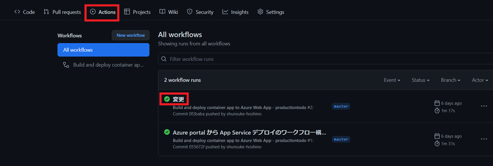

# ToDoアプリ作成
## settings.pyの編集
↓todoproject/settings.py

```
INSTALLED_APPS = [
    'django.contrib.admin',
    'django.contrib.auth',
    'django.contrib.contenttypes',
    'django.contrib.sessions',
    'django.contrib.messages',
    'django.contrib.staticfiles',
    #以下の様に編集
    'todo.apps.TodoConfig',
]
```
settings.pyのデータベースはデフォルトではsqlite3になっているのでコメントアウトします。
```
# DATABASES = {
#     'default': {
#         'ENGINE': 'django.db.backends.sqlite3',
#         'NAME': BASE_DIR / 'db.sqlite3',
#     }
# }
```
新しくデータベースでpostgresの設定を追加します。
```
DATABASES = {
    'default': {
        'ENGINE': 'django.db.backends.postgresql_psycopg2',
        'NAME':  env('DB_NAME'),
        'USER': env('DB_USER'),
        'PASSWORD': env('DB_PASSWORD'),
        'HOST': env('DB_HOST'),
        'PORT': env('DB_PORT'),
    }
}
```
### モデルの定義
↓todo/models.py
```
from django.db import models 


class Todo(models.Model): 
    todo = models.CharField('ToDo', max_length=100, blank=False)
    created_at = models.DateTimeField('作成日時', auto_now_add=True)
    updated_at = models.DateTimeField('更新日時',auto_now=True)

    def __str__(self):
        return self.todo
```

### フォーム作成
forms.pyの作成
```
touch todo/forms.py
```

↓todo/forms.p
```
from django import forms
from .models import Todo

class TodoForm(forms.ModelForm):
    class Meta:
        model = Todo
        exclude = ('created_at','updated_at',)  #入力項目から作成日時、更新日時を除外
```

### vies.pyの編集
↓todo/views.py
```
from django.views import generic
from django.urls import reverse_lazy
from .models import Todo
from .forms import TodoForm

# ToDoの一覧表示機能
class TodoListView(generic.ListView):
    model = Todo
    paginate_by = 5

# ToDoの詳細表示機能
class TodoDetailView(generic.DetailView):
    model = Todo

# ToDoの作成機能
class TodoCreateView(generic.CreateView):
    model = Todo
    form_class = TodoForm
    success_url = reverse_lazy('todo:list')

# ToDoの編集機能
class TodoUpdateView(generic.UpdateView):
    model = Todo
    form_class = TodoForm
    success_url = reverse_lazy('todo:list')

# ToDoの削除機能
class TodoDeleteView(generic.DeleteView):
    model = Todo
    success_url = reverse_lazy('todo:list')

```

### URLを設定
↓todoproject/urls.py
```
from django.contrib import admin
from django.urls import path, include

urlpatterns = [
    path('admin/', admin.site.urls),
    path('todo/', include('todo.urls')),
]
```

↓ todo/urls.py
```
from django.urls import path
from . import views 

app_name = 'todo' 

urlpatterns = [
    path('list/', views.TodoListView.as_view(), name='list'), 
    path('detail/<int:pk>/', views.TodoDetailView.as_view(), name='detail'), 
    path('create/', views.TodoCreateView.as_view(), name='create'), 
    path('update/<int:pk>/', views.TodoUpdateView.as_view(), name='update'), 
    path('delete/<int:pk>/', views.TodoDeleteView.as_view(), name='delete'), 
]
```

## テンプレート作成
フォルダを作成します。
```
mkdir todo/templates
mkdir todo/templates/todo
```
htmlファイルを作成します。
```
touch todo/templates/base.html
touch todo/templates/todo/todo_list.html
touch todo/templates/todo/todo_detail.html
touch todo/templates/todo/todo_form.html
touch todo/templates/todo/todo_confirm_delete.html
```
↓todo/templates/base.html
```

<!DOCTYPE html>
<html lang="ja">
<head>
    <meta charset="utf-8">
</head>
<body>
    
    
</body>
</html>
```

↓todo/templates/todo/todo_list.html
```



<h1>ToDoの一覧</h1>
<a href="">追加</a>
<table>
  <thead>
    <tr>
      <th scope="col">ID</th>
      <th scope="col">ToDo</th>
      <th scope="col">作成日時</th>
      <th scope="col">更新日時</th>
      <th scope="col">操作</th>
    </tr>
  </thead>
  <tbody>
    
    <tr>
      <td scope="row"><a href="">{{ item.id }}</a></td>
      <td>{{ item.todo }}</td>
      <td>{{ item.created_at }}</td>
      <td>{{ item.updated_at }}</td>
      <td>
        <a href="">修正</a>
        <a href="">削除</a>
      </td>
    </tr>
    
  </tbody>
</table>

```

↓todo/templates/todo/todo_detail.html
```



<h1>ToDoの詳細</h1>
<table>
    <tr>
        <th>ID</th>
        <td>{{ object.id }}</td>
    </tr>
    <tr>
        <th>ToDo</th>
        <td>{{ object.todo }}</td>
    </tr>
    <tr>
        <th>作成日時</th>
        <td>{{ object.created_at }}</td>
    </tr>
    <tr>
        <th>更新日時</th>
        <td>{{ object.updated_at }}</td>
    </tr>
</table>
<a href="">戻る</a>

```

↓todo/templates/todo/todo_form.html
```





<h1>ToDoの編集</h1>

<h1>ToDoの作成</h1>


<form method="post">
    
    {{ form }} 
    <button type="submit">送信</button>
</form>
<a href="">戻る</a>

```

↓todo/templates/todo/todo_confirm_delete.html
```



<h1>ToDoの削除</h1>
<table>
    <tr>
        <th>ID</th>
        <td>{{ object.id }}</td>
    </tr>
    <tr>
        <th>ToDo</th>
        <td>{{ object.todo }}</td>
    </tr>
    <tr>
        <th>作成日時</th>
        <td>{{ object.created_at }}</td>
    </tr>
    <tr>
        <th>更新日時</th>
        <td>{{ object.updated_at }}</td>
    </tr>
</table>
<form action="" method="post">
    
    <input type="submit"value="削除" />
</form>
<a href="">戻る</a>

```


# Githubにプッシュしてデプロイされたことを確認する
Github actionsからTodoアプリがAzureに自動デプロイされたことを確認してください。  

また実際にWebサイトにアクセスしてTodoアプリがしっかりと機能しているか確認してみてください。
