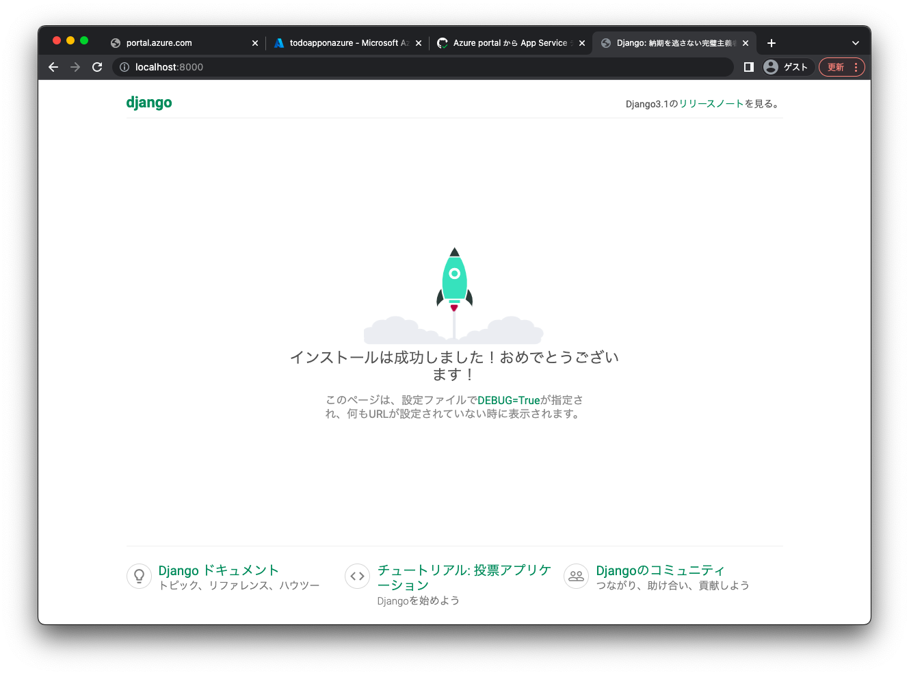

[READMEに戻る](https://github.com/alterbooth/hol-todo-app-on-azure)
# 環境構築
## GithubでこのリポジトリをForkする
右上↗️の「Fork」を押します。<br>
左上↖️のリポジトリ名が、「自分の名前/hol-todo-app-on-azure」と表示されていたらOKです。
## Githubからコードをcloneする
まず、ターミナルを開きます。<br>
次に、リポジトリをローカルPCにクローンします。 【クローンするディレクトリに注意してください】

```
cd Desktop
git clone 自分のリポジトリのURL
```
クローンできたか、「ls」コマンドで確認します。<br>
「hol-todo-app-on-azure」が表示されたらOKです。
## VSCodeを開く
事前準備でVSCodeの設定をしていれば、以下のコマンドでVSCodeを開くことができます。<br>
※設定していない人はVSCodeのアプリからクローンしたフォルダを開いてください。
```
code hol-todo-app-on-azure
```
----
## Docker起動
dockerのアプリを起動します。

----
## シェルスクリプト実行権限付与
docker-compose.ymlがstartup.shを実行できるように権限を付与します。
```
chmod +x startup.sh 
```
----
## プロジェクト&アプリ作成

* Djangoプロジェクト作成
* Djangoアプリ作成
----

以下のコマンドでpythonイメージから作成されたコンテナでDjangoのプロジェクトを作成します。
```
docker compose run web django-admin.py startproject todoproject .
```
以下のコマンドでDjangoのアプリを作成します。
```
docker compose run web django-admin.py startapp todo
```
----
## 環境変数の設定
SECRET_KEYは公開してはいけないので環境変数を使います。

**settings.py** の SECRET_KEY を **docker-compose.yml** の SECRET_KEY に記述します。

↓docker-compose.yml のSECRET_KEYを設定
```
environment:
      - SECRET_KEY= ここにsettings.pyに書いてあるSECRET_KEYを記述
```

↓settings.py に以下を追加
```
import environ
import os

env = environ.Env()
env.read_env(os.path.join('.env'))
```
```
SECRET_KEY = env('SECRET_KEY')
```

----

## プロジェクトの設定を変更
ホストヘッダー攻撃対策で、ALLOWED_HOSTSにはWebサービスを提供するドメイン名を指定する必要があります。ついでに言語とタイムゾーンも指定。
```
ALLOWED_HOSTS = ['*']
```
```
LANGUAGE_CODE = 'ja'
TIME_ZONE = 'Asia/Tokyo'
```

## サーバ起動用スクリプト
Django サーバを起動するためにDockerfileのコメントアウトを外します。shファイルにはサーバを起動するコマンドが書かれています。


↓Dockerfile
```
RUN chmod 744 ./startup.sh
ENTRYPOINT ["./startup.sh"]
```

## ロケット打ち上げ
以下のコマンドを実行し、ロケットが打ち上がったら成功です。
```
docker compose build 
docker compose up
```



サーバ停止： control + c
```
docker compose down
```


----
# 次へ
次はデプロイです。<br>
[デプロイの資料](デプロイ.md)

[READMEに戻る](https://github.com/alterbooth/hol-todo-app-on-azure)


